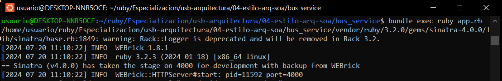

# Práctica de Arquitectura de Software
## Lenguaje
Ruby 3.2.0

### 01-estilo-arq-capas
Ejecución
```bash
ruby 01-estilo-arq-capas/start.rb

# Administracion de usuarios
# Base de datos inicializada
# 
# Seleccione una opción:
# 1. Registrar usuario
# 2. Buscar usuario
# 3. Editar usuario
# 4. Eliminar usuario
# 5. Salir
```

### 02-estilo-arq-cliente-servidor
Ejecución
```bash
ruby 02-estilo-arq-cliente-servidor/start.rb

# Seleccione una opción:
# 1. Iniciar servidor
# 2. Detener servidor
# 3. Iniciar cliente
# 4. Enviar mensaje
# 5. Terminar conexión
# 6. Sali
```

### 04-estilo-arq-soa
Ejecución
```bash
# Iniciar el bus de servicios
cd 04-estilo-arq-soa
bundle exec ruby bus_service/app.rb
```


```bash
# Iniciar el servicio de usuarios
cd 04-estilo-arq-soa
bundle exec ruby user_service/app.rb
```


```bash
# Iniciar el servicio de usuarios
cd 04-estilo-arq-soa
bundle exec ruby user_service/app.rb
```


Consumo del servicio
1. Listar usuarios


2. Listar productos


3. Crear usuarios


4. Crear productos


### 08-estilo-arq-espacio-nombres
Ejecución
```bash
# Iniciar servidor
cd 08-estilo-arq-espacio-nombres
bundle exec ruby server.rb

# == Sinatra (v4.0.0) has taken the stage on 4567 for development with backup from Puma
# Puma starting in single mode...
# * Puma version: 6.4.2 (ruby 3.2.3-p157) ("The Eagle of Durango")
# *  Min threads: 0
# *  Max threads: 5
# *  Environment: development
# *          PID: 36348
# * Listening on http://127.0.0.1:4567
# * Listening on http://[::1]:4567
# Use Ctrl-C to stop
```

```bash
# Iniciar cliente
ruby 08-estilo-arq-espacio-nombres/client.rb

# Seleccione una opción:
# 1. Agregar producto
# 2. Listar productos
# 3. Salir
```

### 10-estilo-arq-agentes
Ejecución
```bash
ruby 10-estilo-arq-agentes/start.rb

# Seleccione una opción:
# 1. Inicilizar agente de tareas
# 2. Registrar una tarea
# 3. Listar tareas
# 4. Inicializar agente de usuarios
# 5. Crear usuario
# 6. Listar usuarios
# 7. Asignar tarea
# 8. Salir
```

### 11-estilo-arq-monolitica
Ejecución
```bash
cd 11-estilo-arq-monolitica
bundle exec ruby app.rb

# == Sinatra (v4.0.0) has taken the stage on 4567 for development with backup from Puma
# Puma starting in single mode...
# * Puma version: 6.4.2 (ruby 3.2.3-p157) ("The Eagle of Durango")
# *  Min threads: 0
# *  Max threads: 5
# *  Environment: development
# *          PID: 41839
# * Listening on http://127.0.0.1:4567
# * Listening on http://[::1]:4567
```


### 12-estilo-arq-p2p
```bash
ruby 12-estilo-arq-p2p/start.rb 3001

# Nodo corriendo en el puerto 3001
# 
# Seleccione una opción:
# 1. Enviar mensaje
# 2. Conectar con un nodo
# 3. Listar nodos
# 4. Salir
```

```bash
ruby 12-estilo-arq-p2p/start.rb 3002 3001

# Nodo corriendo en el puerto 3002
# Conectado con el nodo en el puerto 3001
# 
# Seleccione una opción:
# 1. Enviar mensaje
# 2. Conectar con un nodo
# 3. Listar nodos
# 4. Salir
```

```bash
ruby 12-estilo-arq-p2p/start.rb 3003 3002 3001

# Nodo corriendo en el puerto 3003
# Conectado con el nodo en el puerto 3001
# Conectado con el nodo en el puerto 3002
# 
# Seleccione una opción:
# 1. Enviar mensaje
# 2. Conectar con un nodo
# 3. Listar nodos
# 4. Salir
```


